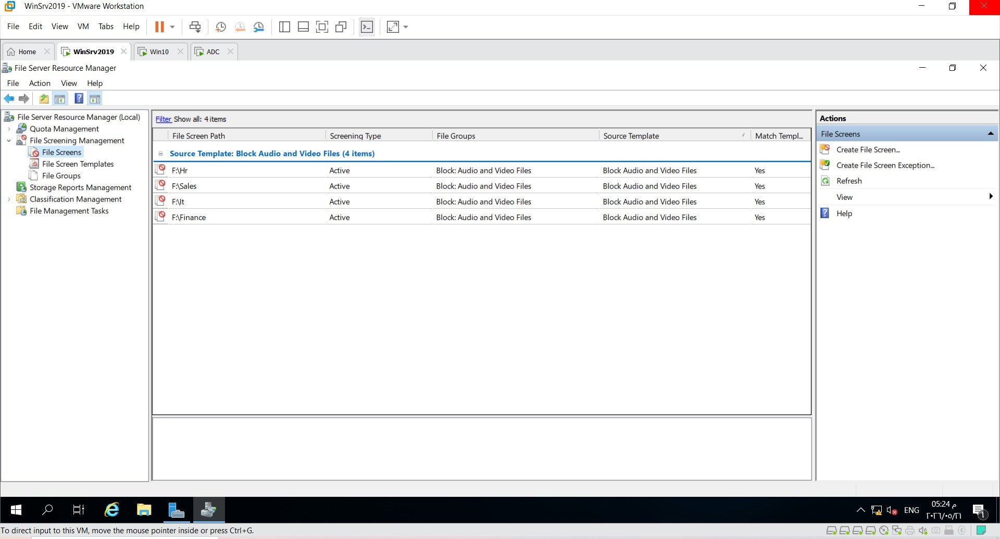

# Enterprise-Windows-Server-Infrastructure-Deployment

## 📌 Project Overview
This project demonstrates the architecture, deployment, and configuration of a resilient and secure enterprise infrastructure using **Windows Server 2019** within a VMware Workstation environment. The environment is engineered around the domain `test.local` to simulate a real-world corporate network consisting of a Primary Domain Controller, an Additional Domain Controller (Server Core), network clients, and essential infrastructure roles.

---

## 🏗️ Infrastructure Architecture & Core Components

### 1. Identity & Directory Services (AD DS)
* **Domain Name:** `test.local`
* **Domain Controllers:** * `PDC`: Primary Domain Controller (Desktop Experience).
  * `ADC`: Additional Domain Controller deployed on **Windows Server Core** for efficiency and attack-surface reduction.
* **OU Structure:** Organically segmented into departmental Units (`HR`, `IT`, `Finance`, `Sales`, `Groups`).

### 2. High Availability & Network Services
* **DHCP Failover:** Configured an IPv4 Scope (`192.168.1.0/24`) in a **Failover Relationship** between `PDC` and `ADC` to ensure continuous network state and prevent single points of failure.
* **DNS Administration:** Maintained a healthy Forward Lookup Zone including proper record mapping (`A` records for FileServer, WebServer, PDC, ADC, and client PCs).
* **WDS (Windows Deployment Services):** Configured for automated network-based OS deployment.

### 3. Storage & Endpoint Management (File Services & GPO)
* **Central Share & GPO Mapping:** Automated folder accessibility through GPO Map Drives targeting specific departments (`add-finance-map-drive`, `add-hr-map-drive`, etc.).
* **FSRM (File Server Resource Manager):** Implemented strict **Active File Screening** templates to explicitly block Audio and Video files from eating up file server capacity across departmental shares (`F:\HR`, `F:\Sales`, `F:\IT`, `F:\Finance`).
* **Endpoint Hardening:** Enforced enterprise policies via GPO:
  * Prohibiting access to all external storage devices.
  * Disabling Command Prompt (`cmd`) access for standard users.
  * Mapping local group policies (`make-it-group-local-admin`).

### 4. Backup & Remote Access
* **Disaster Recovery:** Set up daily automated schedules via **Windows Server Backup** to minimize data loss.
* **Remote Administration:** Configured **Remote Desktop (RDP)** combined with **RSAT** for centralized and secure remote server management.
* **IIS Hosting:** Set up a local default web server page routed internally via DNS.

---

## 📸 Deployment Gallery

### Active Directory OU & User Infrastructure

### Group Policy Management & Enforcement

### High Availability DHCP Failover

### Storage Control via FSRM File Screening

